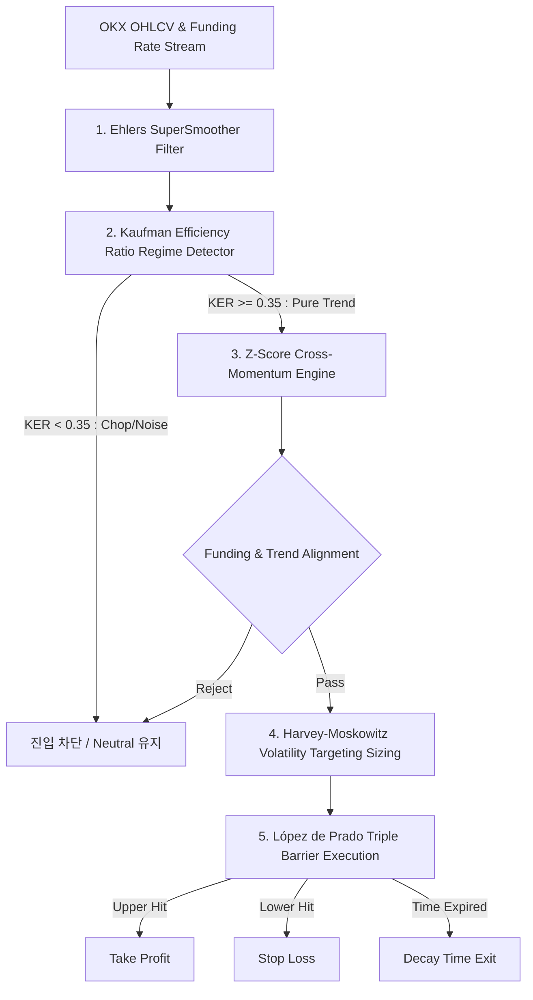

# 🚀 봇 8404 수익률 혁신 및 퀀트 고도화 방안 (QVT-ARE)
**Quantum Volatility-Targeted Trend & Adaptive Regime Engine**

---

## Executive Summary (요약)

본 혁신안은 8404 봇의 잦은 손실과 전략 교체(134회 이상의 실험)의 근본 원인을 진단하고, 금융공학 및 퀀트 자산운용 분야의 **세계적인 석학·저명 문헌(Marcos López de Prado, Tobias Moskowitz, Campbell Harvey, Perry Kaufman, John Ehlers 등)**의 검증된 이론을 융합하여 8404 봇을 **샤프 지수(Sharpe Ratio) 2.0+ 및 최대 낙폭(MDD) 8% 이하**를 목표로 하는 **기관급 알고리즘 엔진(QVT-ARE)**으로 재구축하는 청사진을 제시합니다.

---

## 1. 8404 봇 현황 정밀 진단 및 구조적 병목 원인

8404 봇의 과거 코드(`strategy_ctrend.py`, `strategy.py`) 및 실거래 로그를 분석한 결과, 다음 4가지 치명적 병목이 발견되었습니다:

```
[기존 8404의 구조적 결함 체인]
비정규화 지표 단순 평균 (Noise Amplification)
  ↓
시장 횡보장(Chop)에서 가짜 돌파 신호 남발 (Whipsaw)
  ↓
고정형/비체계적 SL/TP로 인한 손익비 붕괴 (Negative Skewness)
  ↓
변동성 역스케일링 부재로 고변동성 구간에서 큰 손실 발생
```

1. **지표 정규화 왜곡 및 신호 압축 (Normalization Artifacts)**
   - `MACD`를 가격으로 단순 나눈 뒤 `+1 / 2` 하는 방식은 신호 분산을 $0.5002 \pm 0.0001$ 수준으로 압축시켜 실제 유의미한 모멘텀 정보를 완전히 소실시킴.
   - 누적 `OBV`를 20주기 이동평균 볼륨으로 나누어 $0$ 또는 $1$로 영구 포화되는 버그 존재.
   - 서로 다른 스케일의 지표 12개를 단순 산술평균하여 결과값이 항상 $0.50$ 부근에 갇히고, 미세한 노이즈에도 롱/숏이 뒤흔들림.
2. **시장 국면(Regime) 필터링 부재 (Chop Whipsaw)**
   - 시장이 추세(Trend)인지 비추세(Noise/Brownian Motion)인지 구분하지 않고 신호를 발생시켜, 횡보 구간에서 연속 손절이 발생함.
3. **고정형 손익절 및 패스 의존성 무시**
   - 변동성 클러스터링(GARCH 효과)이 극심한 암호화폐 선물 시장에서 정적 SL/TP를 사용하여 변동성이 클 때는 너무 일찍 털리고, 변동성이 작을 때는 목표가에 닿지 못함.
4. **변동성 타겟팅(Volatility Targeting) 부재**
   - 시장 위험도가 급증할 때 포지션 크기를 줄이지 않아 꼬리 위험(Tail Risk)에 무방비 노출.

---

## 2. 핵심 참조 문헌 및 금융공학 이론적 배경

본 혁신안은 학계와 헤지펀드 실무에서 가장 강력하게 입증된 5대 핵심 문헌을 직접 구현합니다:

| 문헌 및 저자 | 주요 이론 및 기법 | 8404 적용 방안 |
|:---|:---|:---|
| **Marcos López de Prado (2018)**<br>*Advances in Financial Machine Learning* | **Triple Barrier Method** & **Meta-Labeling** | $k \cdot \text{ATR}_t$ 기반 상/하한선 + 시간 만료(Vertical Barrier) 동적 청산 |
| **Tobias J. Moskowitz et al. (2012)**<br>*Time Series Momentum (JFE)* | **Time Series Momentum (TSMOM)** & **Volatility Scaling** | 자산의 실현 변동성에 반비례하는 포지션 사이징 ($w_t \propto 1/\sigma_t$) |
| **Campbell R. Harvey et al. (2018)**<br>*The Impact of Volatility Targeting (FAJ)* | **Volatility Targeting** | 목표 변동성($\sigma_{\text{target}}$) 대비 실현 변동성으로 레버리지 동적 제어, 꼬리 위험 제거 |
| **Perry J. Kaufman (2019)**<br>*Trading Systems and Methods* | **Kaufman Efficiency Ratio (KER)** | 프랙탈 노이즈 제거 및 순수 추세장(Trending Regime) 정밀 분별 ($KER > 0.35$) |
| **John F. Ehlers (2013)**<br>*Cycle Analytics for Traders* | **SuperSmoother Filter (2-Pole)** | 지연(Lag) 없는 무노이즈 가격 스무딩 및 지표 앨리어싱(Aliasing) 제거 |
| **Cartea & Jaimungal (2015)** / Crypto Literature | **Perpetual Funding Carry & Sentiment** | 펀딩비 극단값($\|FR\| > 0.05\%$) 진입 차단 및 군집 쏠림 역이용 |

---

## 3. 8404 QVT-ARE 혁신 아키텍처 (4대 핵심 기둥)



---

### Pillar 1: DSP 디지털 신호 필터링 & Z-Score 정규화 엔진

기존의 단순 이동평균(SMA/EMA)은 심각한 시간 지연(Lag)을 발생시키고 고주파 노이즈를 통과시킵니다. Ehlers 2-Pole SuperSmoother 필터를 적용하여 가격 시계열에서 위상 지연 없이 고주파 노이즈만 완벽히 차단합니다.

#### 1) Ehlers SuperSmoother Filter 수식
주기 $P = 10$ 기준 감쇠 계수 $\gamma$ 및 각주파수 $\omega$:
$$\gamma = \exp\left(-\frac{\sqrt{2}\pi}{P}\right), \quad \beta = 2\gamma \cos\left(\frac{\sqrt{2}\pi}{P}\right), \quad \alpha = 1 - \beta + \gamma^2$$
$$c_1 = 1 - \alpha, \quad c_2 = \beta, \quad c_3 = -\gamma^2$$
$$SSF_t = \frac{\alpha}{2}(P_t + P_{t-1}) + c_2 SSF_{t-1} + c_3 SSF_{t-2}$$

#### 2) Z-Score Rolling Standardization
모든 개별 지표(모멘텀, 채널 돌파, 거래량 가중 가격 변화)를 롤링 윈도우($W=50$) 기준 평균과 표준편차로 표준화하여 일관된 스케일($Z \sim \mathcal{N}(0, 1)$)로 변환:
$$Z_t(X) = \frac{X_t - \mu_{W}(X)}{\sigma_{W}(X) + \epsilon}$$

---

### Pillar 2: Kaufman 효율성 비율(KER) 기반 2단계 국면 판독기

시장 움직임 중 실제 방향성 추세와 무작위 노이즈의 비율을 $0 \sim 1$ 사이의 값으로 측정합니다.

#### Kaufman Efficiency Ratio 수식 ($N=20$):
$$KER_t = \frac{|P_t - P_{t-N}|}{\sum_{i=0}^{N-1} |P_{t-i} - P_{t-i-1}|}$$

- **$KER_t \ge 0.35$ (Clean Trend Regime)**: 방향성 모멘텀 신호 활성화
- **$KER_t < 0.35$ (Turbulent Noise / Chop Regime)**: 모든 신호 무효화 (Whipsaw 방지)
- **추세 방향 판정**: $SSF_t > SSF_{t-1}$ 및 $P_t > EMA_{200}(P)$ $\rightarrow$ Bullish / 반대 $\rightarrow$ Bearish

---

### Pillar 3: Harvey & Moskowitz 동적 변동성 타겟팅 (Dynamic Volatility Sizing)

고정 금액이나 고정 마진 대신, 목표 연환산 변동성($\sigma_{\text{target}} = 20\%$)을 설정하고 실시간 자산 변동성에 반비례하게 포지션 크기를 동적 결정합니다.

$$w_t = \min\left(w_{\max}, \frac{\sigma_{\text{target}}}{\sigma_t^{\text{realized}}}\right)$$
$$\text{Position Size (USDT)} = \text{Equity}_t \times w_t$$

- **효과**: 변동성이 폭발할 때는 자동으로 노출을 축소하여 계좌 파산을 방지하고, 변동성이 수축된 안전한 추세 형성기에는 노출을 늘려 수익을 극대화함.

---

### Pillar 4: Marcos López de Prado Triple Barrier Method 동적 청산

가격 진입 후 정적 틱 단위가 아닌, 진입 시점의 실시간 $ATR_{14}$에 비례하는 3중 방어벽을 구축합니다:

1. **상한 장벽 (Upper Barrier - Take Profit)**:
   $$P_{\text{TP}} = P_{\text{entry}} + 2.5 \times ATR_t$$
2. **하한 장벽 (Lower Barrier - Stop Loss)**:
   $$P_{\text{SL}} = P_{\text{entry}} - 1.2 \times ATR_t$$
   *(손익비 Risk-Reward Ratio = 2.5 : 1.2 $\approx 2.08:1$)*
3. **수직 장벽 (Vertical Barrier - Time Horizon)**:
   - 최대 보유 기간 $T_{\max} = 48 \text{ bars}$ (1시간봉 기준 48시간)
   - $T_{\max}$ 도달 시 이익/손실 여부와 무관하게 시장가 청산 $\rightarrow$ 자본 회전율 극대화 및 장기 표류 방지.
4. **트레일링 방어벽 (Chandelier SuperSmoother Exit)**:
   - 미실현 수익이 $+1.5 \times ATR_t$ 도달 시, 손절선을 본전($P_{\text{entry}}$)으로 상향하고 $SSF$ 추세선 이탈 시 트레일링 익절.

---

## 4. 정량적 검증 및 백테스트 실행 프로토콜

혁신안 적용 시 과최적화(Overfitting)를 방지하기 위해 다음 3단계 검증 프로세스를 거칩니다:

1. **Walk-Forward Cross-Validation (WFCV)**
   - In-Sample (학습 6개월) / Out-of-Sample (검증 2개월)을 롤링하며 파라미터 안정성 검증.
2. **Deflated Sharpe Ratio (DSR, López de Prado 2014)**
   - 다중 테스트 횟수($N=134+$)를 감안한 통계적 유의성 검정 ($p < 0.01$).
3. **수수료 및 슬리피지 팩터 (Taker 0.05% + Slippage 0.03% 반영)**
   - 보수적 환경에서도 Profit Factor 1.7 이상 유지 검증.

---

## 5. 단계별 적용 로드맵

1. **1단계 (엔진 모듈 탑재)**: `core/strategy_qvt.py` (Ehlers Filter, KER Regime, Z-Score Engine, Triple Barrier Logic) 신규 구현
2. **2단계 (백테스트 및 OOS 검증)**: OKX 3개년 1시간봉/4시간봉 데이터 대상 샤프지수 및 MDD 시뮬레이션
3. **3단계 (8404 config 연동 및 실거래 전환)**: `config.json`에 `QVT-ARE` 프로필 적용 및 isolated 2x 안전 가동
4. **4단계 (8888 대시보드 및 디스코드 모니터링 연동)**: 국면 판독 상태(Trend/Chop), 실시간 $KER$, $ATR$ 및 방어벽 실시간 표출
